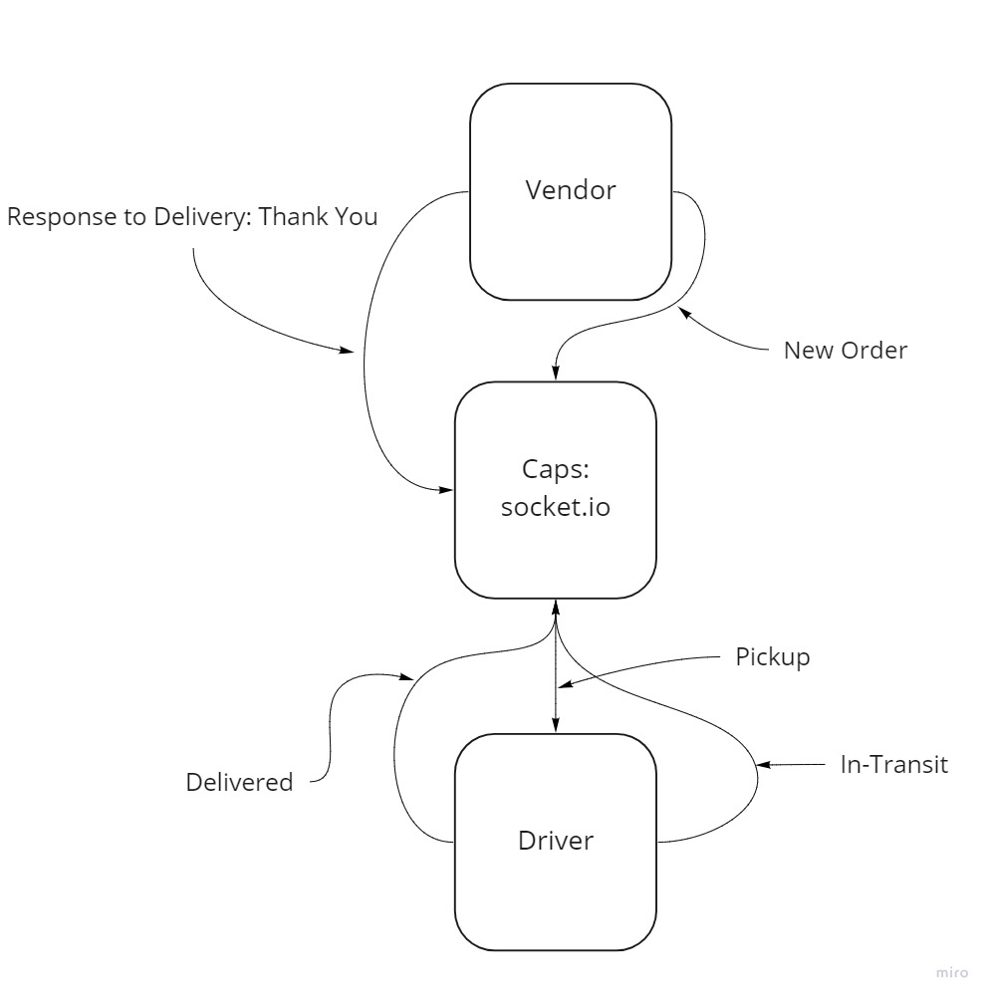

# caps-phase-2-driver

# Lab 12 ==> Event Driven App

## Deployment Test

Author: Davion Garcia
Partner: Terrence Simms

- [Pull Req 1]()
- Local Testing: Jest

## Setup
- npm i
- dependencies: socket.io socket.io-client

## Running the app

- Fires events when a 'pickup' event hits port 3000

## Tests

- Units tests
- Event handler functions

## UML

- Whiteboard:

